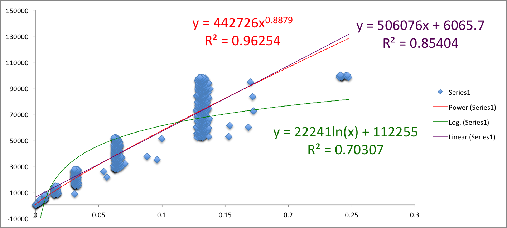

# Coding exercise - Prime tables 
##### Ruby 2.2.4p230

## Introduction
Write an application that takes numeric input (N) from a user and outputs a multiplication table of (N) prime numbers.

## Install
`git clone github url`
`cd find_n_primes_ruby`
`bundle install`

## Run 
```
> ruby bin/find_n_primes 7                                
+----+----+----+----+-----+-----+-----+-----+
|    | 2  | 3  | 5  | 7   | 11  | 13  | 17  |
| 2  | 4  | 6  | 10 | 14  | 22  | 26  | 34  |
| 3  | 6  | 9  | 15 | 21  | 33  | 39  | 51  |
| 5  | 10 | 15 | 25 | 35  | 55  | 65  | 85  |
| 7  | 14 | 21 | 35 | 49  | 77  | 91  | 119 |
| 11 | 22 | 33 | 55 | 77  | 121 | 143 | 187 |
| 13 | 26 | 39 | 65 | 91  | 143 | 169 | 221 |
| 17 | 34 | 51 | 85 | 119 | 187 | 221 | 289 |
+----+----+----+----+-----+-----+-----+-----+
```

## Run tests
`rspec spec`

## Benchmark
`ruby ./benchmark/benchmark.rb`

### Dataset
`./benchmark/regression_worksheet.xlsx`

### Limit of the function



> n = 1000
> O(n^c) Fractional Power
> y = 442726x^(0.8879)
> R^2 = 0.96254

#### Other limits
n = 1000
O(n) Linear
y = 506076x + 6065.7
R^2 = 0.85404

n = 1000
O(log n) Logarithmic
y = 22241ln(x) + 112255
R^2 = 0.70307

## I am pleased with
Ruby is a nice language. I like working with it.

## Given more time I would
Integrated the segmented sieve with the multiplication table. I understand that separating the prime number calculators and the presentations results in double calculations of the sieved elements.


